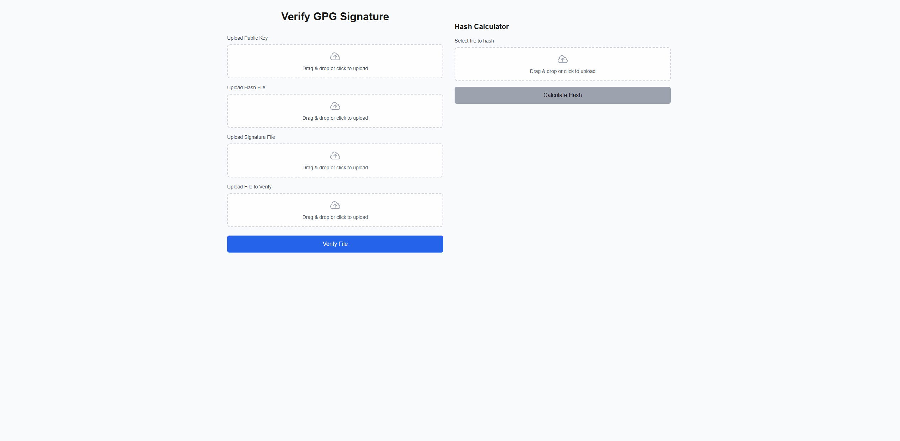

## GPG File Verifier

### What is this tool for?
This tool is for people to verify file integrity when they are given a file from someone who uses GPG. It ensures that the file you have is exactly the same file that the sender intended you to have

### How to use
0. The sender of the file must have a GPG public key and private key. They give out the public key to anyone they want.
1. The sender hashes their file with SHA256. They can use certutil to hash their file. When they hash their file, they must save that hash into a text file and if they want they can add other details in the file like the date they made the file and what the hash is for.

Example hash.txt 
```
Hash malsdmlkmqwd is for the file myprogram.exe. I made this hash on January 1st 2025
```
2. Sender will now sign this file with their private key, so they should now get a hash.txt.sig file. When the sender signs this file, anyone with their public key can 100% verify that the signed file is legitimate.

3. Sender should give the receiver 4 files: Their public key, the hash.txt, the hash.txt.sig, and the file itself (ex. "myprogram.exe")

4. The sender will upload these 4 files to the website and the website will first verify the hash.txt file given the public key and signature file. Then click verify.

Note: The file may say verified, but you should ask the sender to verify their fingerprint like over the phone if you want to be even more sure that the file is legitimate.

### How this works
The main idea is that if the hash.txt is verified, then everything it says should be true, or atleast we know everything it says is from the sender. What we don't know yet is if the file we have is altered. Thats why the website will hash the file and then check to see if this SHA256 hash is the same as what the legitimate hash.txt said. If they match, then by extension, the file is also legitimate.

### Demo
